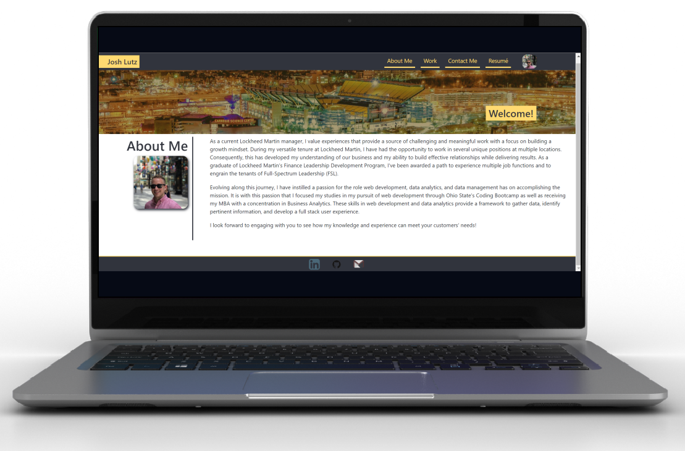

<h1 align="center">
  Josh Lutz Portfolio_v1.0 
  <a href="https://lutz143.github.io/lutz143-efolio/" target="_blank">My eFolio</a>
</h1>

  

---

## Description
Welcome to my personal portfolio! This app is built with React.js including several other technologies such as:
* Node.js
* Express.js
* CSS
* Bootstrap
* HTML
* And Much More!

## Table of Contents
    
- [Features](#features)
- [Installation](#installation)
- [Usage](#usage)
- [Demo](#demo-video)
- [License](#license)

## Features

📖 Multi-Page React Layout

🎨 Styled with React-Bootstrap and CSS

📱 Fully Responsive with Mobile Support

## Installation
In order to install or take a look under the hood, feel free to clone this repo and `npm install` in the project directory. Next, run `npm start` in order to run the app in development mode. 
The app will run on port 3000 at https://localhost:3000 and will refresh when edits are made.

## Usage
This portfolio is to introduce and share recent projects I've worked on in my journey to further understand the developer world.  My goal is to increase collaboration on future projects and document my lessons learned along the way!

---

## Demo Video

  

---

## Questions
* For questions, you may contact me on GitHub: [lutz143](https://github.com/lutz143)

---

## Link
* Link to deployed application: https://lutz143.github.io/lutz143-efolio/

---

## License
ISC